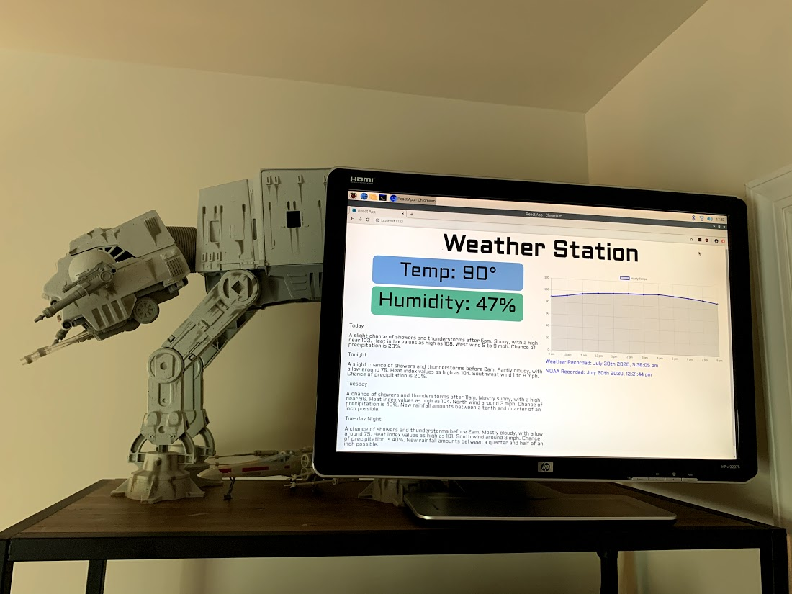
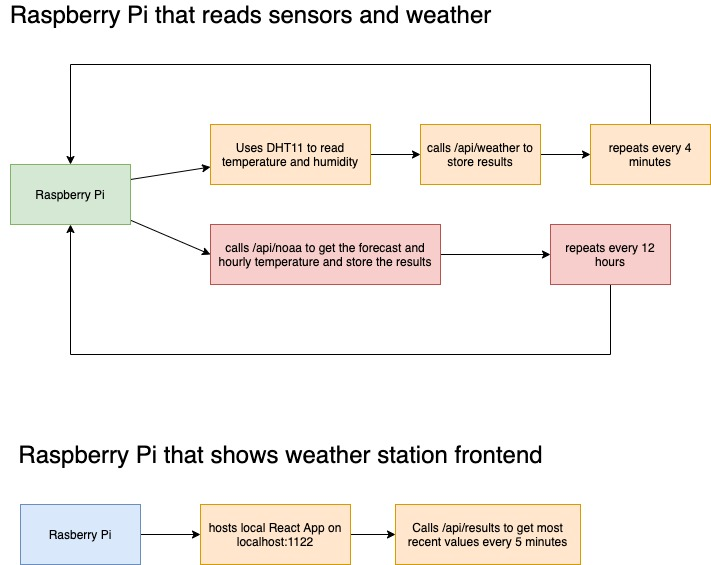

# weather-station

This project creates a weather station using two Raspberry Pis and a DHT11 sensor. The end product runs a python script that uses sensor readings from the DHT11 sensor to get the temperature and humidity. To learn more about this, check out my post [Building a Weather Station with a Raspberry Pi and Firebase](https://rhythmandbinary.com/post/2020-07-20-building-a-weather-station-with-a-raspberry-pi-and-firebase).

## NOAA APIs

The project also calls the National Weather Service APIs ([available here](https://www.weather.gov/documentation/services-web-api)) to provide local forecast data. If you want to use this in your area, you'll need to first call `https://api.weather.gov/points/{<latitude>,<longitude>}` and then you can get the assoicated `forecast` and `forecastHourly` endpoints in the JSON response. You can learn more in my [post here](https://rhythmandbinary.com/post/National_Weather_Service_API). For the purposes of this project, you just need to update the `forecastEndpoint` and `forecastHourlyEndpoint` values in the file at `/frontend/src/app.js`.

## Orchestration

One Raspberry Pi runs two python scripts in the "sensors" folder (I recommend using cronjobs to set them up to repeat). The two python scripts are:

1. `weather.py` runs every 4 minutes and collections the current temperature and humidity and calls the `api/weather` function to update those values in Firebase.
2. `noaa.py` runs every 12 hours and calls the NOAA endpoints to get the forecast and hourly temperatures and then class the `api/noaa` function to update those values in Firebase.

A second Raspberry Pi runs the node server in the `server.js` file at the project root. This serves up a React App that can be reached on port 1122. So if you run `localhost:1122` on the browser on the Raspberry Pi running the frontend you should see the weather station successfully. The frontend calls the `api/results` endpoint every 5 minutes to update the screen to reflect the values retrieved from Firebase.

## Hardware

To run this project, you'll need:

- [Raspberry Pi Zero W](https://www.raspberrypi.org/blog/raspberry-pi-zero-w-joins-family/)
- [Raspberry Pi Model 4](https://www.raspberrypi.org/products/raspberry-pi-4-model-b/)
- Computer Monitor with HDMI input
- DHT11 sensor similar to the one [seen here](https://www.amazon.com/HiLetgo-Temperature-Humidity-Digital-3-3V-5V/dp/B01DKC2GQ0/ref=sr_1_3?dchild=1&keywords=DHT11+sensor&qid=1592333280&sr=8-3)
- Mouse and Keyboard (optional)
- [Firebase](https://firebase.google.com/) Account

## Software

For this to run on the Raspberry Pi, you need a desktop environment ([recommend the Raspbian OS with Desktop](https://www.raspberrypi.org/downloads/raspberry-pi-desktop/). As of 07/20/2020 Raspberry Pi offers a downloader that streamlines this process and can be [seen here](https://www.raspberrypi.org/downloads/).

Once you've got the initial desktop OS setup, I recommend using SSH to do most of the work with the pi directly.

- To copy files from **remote** to **local** system I followed this `scp -r <pi_user>@<pi_address>:<pi_folder> <local_directory_to_upload>`
- To copy files from **local** to **remote** system:
  `scp -r <local_directory_to_upload> <pi_user>@<pi_address>:<pi_folder>`

You'll need to setup the pi with the following:

- Depending on the OS you may need to install `pip` with `sudo apt install python-pip`
- In order for the DHT11 to work with your python program, you'll need to follow the [instructions here](https://learn.adafruit.com/dht-humidity-sensing-on-raspberry-pi-with-gdocs-logging/python-setup)

Then you can run the whole project by first running `./start.sh` and then open the browser to [http://localhost:1122(http://localhost:1122) and you're good to go!

## Firebase

In order to interact with Firebase's Firestore Database, I created an API that you can see in the `functions` folder. This API has endpoints for saving and retrieving the Firestore information. If you want to build this project, you first deploy that to Firebase and then add the HTTP endpoints to the Python scripts in the `sensors` folder and the `useEffect` hook in the React project.

To learn more about this I recommend reading my post [Building an API with Firebase](https://rhythmandbinary.com/post/Building_an_API_with_Firebase).

## Helpful Links

I found the following very helpful when building this project:

- [GPIO numbering](https://raspberrypi.stackexchange.com/questions/12966/what-is-the-difference-between-board-and-bcm-for-gpio-pin-numbering)
- [GPIO setup](https://sourceforge.net/p/raspberry-gpio-python/wiki/BasicUsage/)
- [raspberry pi setup users](https://www.raspberrypi.org/documentation/linux/usage/users.md)
- [setup ssh](https://www.raspberrypi.org/documentation/remote-access/ssh/unix.md)
- [scp usage](https://superuser.com/questions/850740/how-to-upload-local-file-to-server-through-linux-terminal)
- [setup Adafruit_Python_DHT package on Raspberry Pi](https://www.raspberrypi-spy.co.uk/2017/09/dht11-temperature-and-humidity-sensor-raspberry-pi/)
- [setting up rc.local with raspberry pi](https://www.dexterindustries.com/howto/run-a-program-on-your-raspberry-pi-at-startup/)
